# Hi. I'm Srishti 👋
### AI & GenAI Product Manager | Independent Builder

 

*Bridging the gap between frontier AI and tangible business logic to deploy deterministic, ROI-driven products.*

 

## 🧭 Product Philosophy
**"Pushing complexity into deterministic code."** 
As an AI Product Manager, my approach centers on rapid prototyping and rigorous evaluation. I believe GenAI is only as good as the guardrails containing it.
- **ROI-Driven AI**: I don't implement LLMs for the hype; I implement them to drive down operational metrics and scale outputs. 
- **Agentic Workflows over Chatbots**: Moving beyond shallow conversational UI interfaces into multi-step, autonomous orchestrations utilizing MCP (Model Context Protocol), local state machines, and structured memory.
- **First Principles DX/UX**: The end user should never feel the underlying latency or hallucination risks of the AI layers.

| 🧬 **Darwinian Evolution** | 📊 **Decoupled Architecture** | 📈 **ROI-Driven Design** |
| :--- | :--- | :--- |
| **Self-healing pipelines** that monitor errors, mutate code, and test fitness autonomously to survive data drift. | **Separating LLMs** (cognitive routing) from **Python** (deterministic math/parsing) to guarantee zero-hallucination. | Bypassing LLM hype to achieve **2/3rd cost reductions** through local token preprocessing. |

| 🤖 **Agentic Workflows** | 🛡️ **Privacy & Compliance** | ⚡ **First-Principles UX** |
| :--- | :--- | :--- |
| **MCP-driven workflows** utilizing local state machines and memory over basic chat interfaces. | **Local-first redaction** sanitizing sensitive data before it ever hits third-party APIs. | Shaving latency and handling failures gracefully so the end user never sees LLM jitter. |

 

### 🔄 The Deterministic Breakthrough
To deploy LLMs safely in enterprise workflows, I design decoupled agentic systems. By isolating probabilistic thinking from deterministic execution, we turn fragile text generation into stable software engineering.

```mermaid
graph TD
    subgraph traditional_sub [Probabilistic & Fragile - High Token Cost]
        A[Raw Document] --> B[LLM Direct Processing]
        B -->|Formatting Errors| C[Fragile Outputs]
    end

    C -.->|Paradigm Shift to Decoupled Design| D

    subgraph decoupled_sub [Deterministic & ROI-Driven - 2/3rd Cost Saved]
        D[Raw Document] --> E[Local Token Preprocessing]
        E -->|Pruned Payload| F[Cognitive Router LLM]
        F -->|Schema Routing| G[Deterministic Python Primitives]
        G --> H[Pydantic Closed-Loop Validation]
        H -->|Validation Pass| I[100% Reliable Output]
        H -->|Validation Fail| F
    end
    
    style traditional_sub fill:#2c1f1f,stroke:#ff6b6b,stroke-width:1px
    style decoupled_sub fill:#1f2c1f,stroke:#51cf66,stroke-width:1px
```

 

## 🛠️ The AI PM Stack
My technical fluency allows me to prototype core logic loops autonomously before passing them to engineering.

  <strong>Orchestration & LLMs:</strong> 
  
  
  
  
   
  <strong>Backend & Automations:</strong> 
  
  
  
   
  <strong>Product & Design:</strong> 
  
  
  

 

## 📂 Production Repositories & Agentic Systems

### 🧬 [darwinian-doc-extractor-Public-](https://github.com/Srishti331/darwinian-doc-extractor-Public-)
> **Self-Evolving, Production-Grade Data Pipeline**
> An enterprise AI pipeline that autonomously analyzes its own errors, mutates its Python source code, and mathematically evaluates the fitness of its updates to continuously improve unstructured data extraction.

- **Darwinian Self-Evolution Loop**: Integrates a closed-loop mutation cycle that writes, compiles, and evaluates Python patches in isolated test runtimes.
- **Strict Guardrails & Memory**: Employs historical error logging (`errors.json`, `journal.md`) and stateful circuit breakers to prevent infinite token-consumption loops.
- **Robust Failover Architecture**: Automatic failover orchestration traversing Gemini (primary), OpenAI (fallback), and Groq (secondary) on rate-limit detection.
- **PII Compliance Sanitization**: Mathematically redacts sensitive data (SSNs, emails, financial records) locally before transmitting payloads to external LLM APIs.

 

### 📊 [Agentic-Doc-Extractor](https://github.com/Srishti331/Agentic-Doc-Extractor)
> **Decoupled Agentic Pipeline for Unstructured Documents**
> Static codebases decay when confronted with real-world data drift. I architect closed-loop agentic systems that continuously evaluate runtime performance, autonomously patch logic errors, and evaluate fitness scores before committing code updates.

- **Zero-Hallucination Decoupled Engine**: Restricts LLMs to high-level cognitive routing and semantic mapping, leaving text extraction to deterministic Python primitives.
- **Agnostic Skill Schema**: Standardizes parsing structures so the same underlying regex and heuristic engines process invoices, resumes, and legal files dynamically.
- **Local Computes over LLM Token Bloat**: Pre-filters and formats 1M+ token document blocks into clean JSON arrays, slashing LLM processing costs by up to 85%.

 

### 📈 [Agentic-NSE-Screener](https://github.com/Srishti331/Agentic-NSE-Screener)
> **Agentic Equity Screener & Market Analysis Pipeline**
> A production-grade financial screening pipeline combining local quantitative mathematical models with LLM orchestration for daily market reports.

- **Deterministic Quantitative Shield**: Restricts LLM role to market synthesis, calculating RSI/ROE thresholds, technical breakouts, and Stop-Loss boundaries locally inside isolated Python modules.
- **Resilient Web Crawler Layer**: Uses a custom `NSEScraper` primitive with built-in cache mechanics to extract and normalize fragmented market data.
- **Dynamic Actionable Reporting**: Curates thousands of market metrics down to the top 3 high-probability setups daily, generating structured summaries matching custom risk tolerances.

 

Let's build deterministic futures. Reach out on <a href="https://linkedin.com/in/srishti299">LinkedIn</a>.

